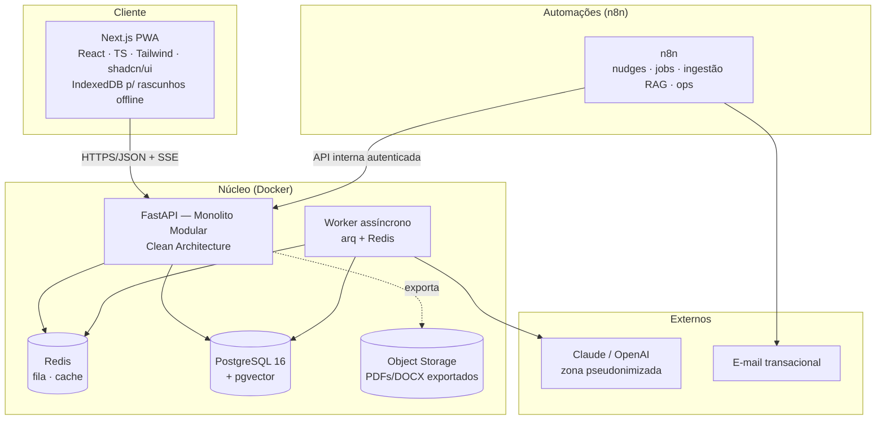

# 03 — Arquitetura de Solução · RAV AI

**Versão:** 1.0 · 06/07/2026 · Aguardando validação
**Depende de:** 02-PRD (RFs/RNFs) · 05-RNs · 07-UX (offline, streaming) · 08-IA (zonas, pipeline)
**Decisões do PO:** stack Next.js/FastAPI/PostgreSQL/pgvector/Docker · n8n em papel híbrido (ADR-003)

---

## 1. Visão geral



## 2. Estilo arquitetural

**Monolito modular** (ADR-001) com **Clean Architecture** por contexto:

```
apps/api/
  src/
    contextos/
      identidade/        (auth, conta, plano)
      estrutura_escolar/ (escola, turma, ano letivo, bimestres)
      estudantes/        (estudante, flags, frequência, transferência)
      observacoes/       (registro, tipos, linha do tempo)
      rav/               (documento, versões, estados, validação, exportação)  ← núcleo do domínio
      ia/                (pipeline, prompts, evals, pseudonimização)
      normas/            (regras versionadas por ano letivo — RN-DOC-006)
      auditoria/         (trilha imutável — RN-FLX-005)
    compartilhado/       (kernel: tipos, eventos, erros)
  Cada contexto: domain/ (entidades, regras) · application/ (casos de uso) ·
  infrastructure/ (repositórios, LLM, PDF) · api/ (rotas)
```

Regras de dependência (SOLID): `domain` não importa nada externo; `application` orquestra via interfaces (ports); `infrastructure` implementa adapters (LLM provider-agnostic — 08-IA §3, PDF, storage). Comunicação entre contextos por eventos de domínio internos (ex.: `RavExportado` → auditoria + métricas) — prepara extração futura de serviços sem custo agora.

### Bounded contexts e linguagem ubíqua (DDD)

| Contexto | Agregados | Observação |
|----------|-----------|------------|
| Estrutura Escolar | Escola, Turma, AnoLetivo(Bimestres) | Cadastro leve B2C (PRD §3) |
| Estudantes | Estudante (flags, frequência) | Titular de dados — LGPD |
| Observações | Observação | Coração do hábito (RN-FLX-002) |
| RAV | DocumentoRav (versões, estado, claims) | Fé pública; máquina de estados RN-* |
| IA | ExecuçãoDePipeline, PromptVersion | Zona pseudonimizada |
| Normas | NormaAnoLetivo (templates, regras, léxicos) | Regras como dados |

## 3. Decisões (ADRs resumidos)

### ADR-001 — Monolito modular, não microserviços
**Contexto:** equipe pequena, produto sazonal, domínio ainda em descoberta. **Decisão:** um deploy, módulos com fronteiras DDD rígidas. **Alternativa rejeitada:** microserviços — custo operacional injustificado agora. **Consequência:** extração futura possível pelas fronteiras de contexto; disciplina de dependências é inegociável (lint de arquitetura no CI).

### ADR-002 — Processamento de IA assíncrono via worker + Redis, streaming via SSE
**Contexto:** geração leva segundos (RNF-004) e picos de fim de bimestre (RNF-007); UI precisa de streaming (07-UX). **Decisão:** requisições de geração entram em fila (arq/Redis); Redator transmite por SSE; validações assíncronas atualizam a zona Qualidade. **Alternativas:** síncrono (não escala pico), WebSocket (complexidade sem necessidade — comunicação é unidirecional). **Consequência:** UX de progresso; retry e rate-limit por usuário na fila (freemium).

### ADR-003 — n8n híbrido (proposta do PO, avaliada)
**Contexto:** PO propôs n8n para tratamento de informações visando manutenção simples. **Análise:** o núcleo (pipeline de IA, validações, domínio) exige testes automatizados, versionamento em código, evals como gate (08-IA §8), streaming, tipagem e fronteira LGPD auditável — frágil em workflows visuais; já os periféricos mudam com frequência e ganham com edição visual sem deploy. **Decisão:** núcleo em FastAPI; **n8n para**: nudges/e-mails (RF-071), jobs agendados (lembretes de calendário de bimestre, limpeza, relatórios internos), ingestão do corpus RAG M3 (download/OCR/chunking com revisão humana), integrações futuras (webhooks) e operações internas. **Restrições:** n8n **nunca** acessa o banco diretamente — somente API interna autenticada com escopo próprio; n8n **nunca** recebe dados identificados de estudante além do mínimo (nudges referenciam contagens, não nomes); workflows exportados e versionados no repositório. **Consequência:** manutenção simples onde é seguro; auditabilidade preservada onde é crítico.

### ADR-004 — PWA com rascunho offline, não app nativo
**Contexto:** P-30s no celular; conexão instável em escola (RNF-005). **Decisão:** PWA instalável; observações e edições persistem em IndexedDB com fila de sincronização e resolução por última-escrita-com-histórico (versões protegem contra perda). **Alternativa rejeitada:** app nativo (custo de manutenção duplo; reavaliar se voz-para-texto web decepcionar — PRD §12).

### ADR-005 — Exportação PDF server-side com template versionado
**Contexto:** fidelidade de fé pública (RN-DOC-001/002). **Decisão:** renderização server-side (HTML→PDF via Chromium headless) a partir de template por ano letivo com teste visual de regressão; DOCX via template OOXML. **Consequência:** pixel-perfect controlado; exportações ficam em object storage com hash na auditoria.

### ADR-006 — Autorização RBAC + escopo por vínculo
JWT curto + refresh (RF-001); toda query filtrada por vínculo professor→turma→estudante no repositório (RN-SEG-003) — o filtro é do repositório, não do handler (impossível esquecer). Preparado para papéis futuros (coordenador M4) via claims de papel por escola.

### ADR-007 — Multi-tenancy lógico com chave de rede
Colunas `rede_id`/`escola_id` desde o dia 1 (Visão: preparado para crescimento nacional), única rede "SEDF" no MVP. Migração para RLS do Postgres quando houver B2B (M4).

## 4. Arquitetura de segurança (síntese — detalhe no doc 11)

- Fronteira de zonas da IA (08-IA §1) implementada como módulo `ia/pseudonimizacao` com teste de vazamento em CI (RNF-009).
- Criptografia: TLS 1.3; repouso via volume criptografado + colunas sensíveis (observações internas 🔒) com criptografia aplicacional.
- Segredos em vault do ambiente; princípio do menor privilégio nos tokens do n8n (ADR-003).
- Trilha de auditoria como tabela append-only (04-Dados §5) — nenhum UPDATE/DELETE permitido por role de aplicação.
- OWASP ASVS L2 (RNF-008): checklist no doc 11 + security review por release.

## 5. Infraestrutura e ambientes

| Aspecto | Decisão |
|---------|---------|
| Empacotamento | Docker Compose (dev) → containers em VPS/cloud gerenciada (prod M1); avaliar managed Postgres |
| Ambientes | dev · staging (dados sintéticos, evals) · prod |
| CI/CD | Lint de arquitetura + testes + evals de IA (gate 08-IA §8) + teste visual de PDF → deploy |
| Backup | PITR do Postgres; teste de restauração mensal (documento de fé pública exige) |
| Observabilidade | Logs estruturados JSON, métricas Prometheus, tracing OpenTelemetry nas chamadas LLM (RNF-012) |
| Escala de pico | Horizontal no worker (fila absorve); cache de validação por hash (08-IA §10) |

## 6. Integrações futuras (preparação sem construção)

i-Educar/SEDF (M5): contexto `estrutura_escolar` isola o formato de importação; exportações já carregam metadados compatíveis. Assinatura digital (M5): máquina de estados já possui o estado-alvo. Gemini: coberto pela abstração de provider.

**Documentos impactados:** 04 (schema), 06 (contratos), 10 (testes de arquitetura), 11 (segurança).
