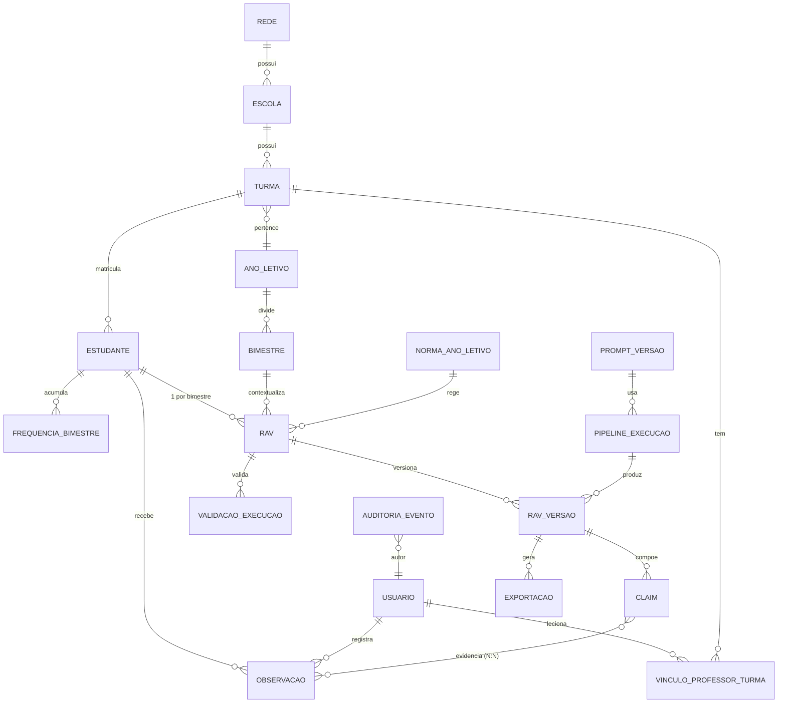

# 04 — Banco de Dados · RAV AI

**Versão:** 1.0 · 06/07/2026 · Aguardando validação
**Depende de:** 03-Arquitetura (contextos, ADR-006/007) · 05-RNs (enums, unicidades, auditoria) · 08-IA (claims, prompts, pseudonimização)
**SGBD:** PostgreSQL 16 + pgvector. Convenções: snake_case; PK `id UUID v7`; `created_at/updated_at` em tudo; soft-delete apenas onde RN exige preservação; migrações Alembic.

---

## 1. Modelo conceitual

## 2. Modelo lógico — tabelas por contexto

### Identidade & Estrutura Escolar

| Tabela | Colunas principais | Notas |
|--------|--------------------|-------|
| `usuario` | id, nome, email UK, senha_hash NULL (OAuth), provedor_oauth, plano (`free/pro`), created_at | RF-001 |
| `rede` | id, nome | "SEDF" no MVP (ADR-007) |
| `escola` | id, rede_id FK, nome, cre | cadastro leve |
| `ano_letivo` | id, escola_id FK, ano SMALLINT, UK(escola,ano) | |
| `bimestre` | id, ano_letivo_id FK, numero 1..4, data_inicio, data_fim, dias_letivos INT, UK(ano_letivo,numero) | RF-011; dias_letivos alimenta RN-RES-004 |
| `turma` | id, escola_id FK, ano_letivo_id FK, bloco (`1/2`), ano_escolar 1..5, letra, turno (`matutino/vespertino/integral`), arquivada BOOL | CHECK bloco×ano (1º bloco=1..3, 2º=4..5) |
| `vinculo_professor_turma` | id, usuario_id FK, turma_id FK, papel (`regente/apoio`), UK(usuario,turma) | base do escopo de acesso (RN-SEG-003) |

### Estudantes

| Tabela | Colunas principais | Notas |
|--------|--------------------|-------|
| `estudante` | id, turma_id FK, **nome_cifrado BYTEA** (nome completo, cifrado em repouso — RN-SEG-006), **codigo_referencia VARCHAR(6)** (iniciais + sufixo de desambiguação, ex. `AO-01`; exibido na UI no lugar do nome; **UK(turma_id, codigo_referencia)**), **flags:** deficiencia_tea BOOL, adequacao_curricular BOOL, temporalidade BOOL, sala_recursos BOOL, superacao BOOL, superacao_atendimento (`classe_comum/turma/turma_reduzida` NULL), superacao_org_curricular (`nao/sim/parcialmente` NULL), status (`ativo/transferido/arquivado`) | Campo A completo (RN-CNT-009); transferido preserva dados (RN-FLX-004); nome completo só é decifrado sob vínculo válido (RN-SEG-003) ou na exportação oficial (RN-DOC-001) |
| `frequencia_bimestre` | id, estudante_id FK, bimestre_id FK, total_faltas INT, justificadas INT DEFAULT 0, UK(estudante,bimestre) | % calculado vs `bimestre.dias_letivos` (RN-RES-004) |

### Observações

| Tabela | Colunas principais | Notas |
|--------|--------------------|-------|
| `observacao` | id, estudante_id FK, autor_id FK, bimestre_id FK, texto TEXT, texto_cifrado BYTEA NULL, tipo (`aprendizagem/dificuldade/intervencao/resultado_intervencao/socioemocional/frequencia_busca_ativa/outra` NULL), exportavel BOOL DEFAULT true, origem (`digitada/voz/entrevista`), data_ocorrencia DATE, grupo_id UUID NULL | tipo NULL até classificação (UX §4.1); socioemocional nasce exportavel=false cifrada (RN-SEG-004); grupo_id liga fan-out multi-estudante (RF-024) |

### RAV (núcleo)

| Tabela | Colunas principais | Notas |
|--------|--------------------|-------|
| `rav` | id, estudante_id FK, bimestre_id FK, norma_id FK, estado (`nao_iniciado/rascunho/validado/exportado/assinado`), resultado_final (`cursando/progressao_continuada/avanco_correcao_fluxo/aprovado/reprovado/abandono` NULL), versao_atual_id FK, **UK(estudante,bimestre)** | RN-FLX-001; RN-RES-001/002; estados RN-DOC-003 |
| `rav_versao` | id, rav_id FK, numero INT, conteudo_campo_b TEXT, campo_a_snapshot JSONB, autor_id FK, origem (`humano/ia/hibrido`), pipeline_execucao_id FK NULL, created_at | **append-only** (RN-FLX-005, RN-DOC-005); snapshot congela o Campo A da época |
| `claim` | id, rav_versao_id FK, ordem, texto, secao (`diagnostico/percurso/resultados/proximos_passos`), tipo (`factual/conectivo`), proveniencia (`professor/ia/ia_editada`), rationale TEXT | 08-IA §2; proveniência RN-IA-004 |
| `claim_evidencia` | claim_id FK, observacao_id FK, PK composta | rastreabilidade N:N (RF-031) |
| `validacao_execucao` | id, rav_id FK, rav_versao_id FK, resultado JSONB (itens: regra, severidade, trecho, status), aprovada BOOL, created_at | RN-IA-005; histórico de pré-voos |
| `validacao_override` | id, validacao_execucao_id FK, regra_codigo, justificativa TEXT, autor_id FK | RF-041 — auditável |
| `exportacao` | id, rav_versao_id FK, formato (`pdf/docx`), arquivo_url, sha256, template_versao, created_at | ADR-005; hash prova integridade |

### Normas (regras como dados — RN-DOC-006)

| Tabela | Colunas principais | Notas |
|--------|--------------------|-------|
| `norma_ano_letivo` | id, ano SMALLINT UK, vigente BOOL, template_pdf_ref, textos_fixos JSONB (campos F/G), fonte_oficial_url | versão 2024 semeada de `00-contexto` |
| `norma_regra` | id, norma_id FK, codigo (ex. `RN-CNT-003`), parametros JSONB (léxicos, limiares, matriz RN-RES-003), severidade (`impedimento/aviso`) | validador lê daqui; alterável sem deploy (RNF-013) |
| `objetivo_aprendizagem` | id, norma_id FK, ano_escolar, componente, descricao, codigo_curriculo | tabela curada (08-IA §7.3, MVP sem RAG) |

### IA

| Tabela | Colunas principais | Notas |
|--------|--------------------|-------|
| `prompt_versao` | id, nome (`redator`), versao (`v1.3`), conteudo, eval_aprovada BOOL, created_at, UK(nome,versao) | gate 08-IA §8 |
| `pipeline_execucao` | id, rav_id FK, etapas JSONB (latências, tokens, modelo por etapa), custo_estimado NUMERIC, prompt_versoes JSONB, status | tracing RNF-012; custo RNF-011 |
| `pseudonimo_dicionario` | id, escopo_execucao_id FK, token, entidade_tipo, entidade_id, **nunca replicado p/ logs** | RN-SEG-001; TTL curto pós-execução |
| `embedding_rav` | rav_versao_id FK, vetor VECTOR(1536) | pgvector — similaridade RF-042 |

### Auditoria (append-only)

| Tabela | Colunas principais | Notas |
|--------|--------------------|-------|
| `auditoria_evento` | id, ocorrido_em, autor_id NULL (sistema), tipo_evento, entidade_tipo, entidade_id, payload JSONB, ip_hash | RN-FLX-005; role da aplicação sem UPDATE/DELETE (trigger de proteção); particionada por mês |

## 3. Regras de integridade (além das FKs)

| # | Regra | Implementação |
|---|-------|---------------|
| I-01 | 1 RAV por estudante×bimestre | UK `rav(estudante_id, bimestre_id)` (RN-FLX-001) |
| I-02 | Resultado final somente no 4º bimestre | CHECK via trigger: `resultado_final IS NULL OR bimestre.numero=4` (RN-RES-001) |
| I-03 | Coerência bloco×ano_escolar | CHECK na `turma` |
| I-04 | Flags SuperAção dependentes | CHECK: atendimento/org_curricular exigem `superacao=true` |
| I-05 | Faltas ≤ dias letivos; justificadas ≤ total | CHECK em `frequencia_bimestre` |
| I-06 | Versões imutáveis | Sem UPDATE em `rav_versao`/`claim` (trigger); correção = nova versão (RN-DOC-005) |
| I-07 | Estado `assinado` exige exportação existente | trigger de transição (RN-DOC-003) |
| I-08 | Matriz resultado×ano×perfil (RN-RES-003) | **camada de domínio** (não trigger — regra rica com override); banco garante apenas domínio do enum |
| I-09 | Claim factual de origem IA exige ≥1 evidência | CHECK diferido via validação de aplicação + eval (RN-IA-002) |
| I-10 | Observação interna nunca em claim_evidencia de versão exportada | constraint de aplicação + teste (RN-SEG-004) |
| I-11 | Código de referência único por turma | UK `estudante(turma_id, codigo_referencia)`; geração automática (iniciais + sufixo sequencial em caso de colisão) na aplicação (RN-SEG-006) |

## 4. Dicionário de dados — campos críticos (amostra normativa)

| Campo | Tipo | Domínio/Origem |
|-------|------|----------------|
| `rav.estado` | enum | máquina de estados UX §6.1 / RN-DOC-003 |
| `rav.resultado_final` | enum | 6 valores exatos do F1-2024 Campo E (RN-RES-002) |
| `estudante.superacao_atendimento` | enum | 3 formas do F1-2024 Campo A |
| `estudante.codigo_referencia` | string | iniciais + sufixo, único por turma — identificação na UI (RN-SEG-006) |
| `estudante.nome_cifrado` | bytea | nome completo cifrado em repouso; decifrado só sob vínculo válido ou na exportação oficial (RN-SEG-006) |
| `observacao.exportavel` | bool | fronteira de sigilo RN-SEG-004 — controla entrada no pipeline |
| `claim.proveniencia` | enum | professor/ia/ia_editada — RN-IA-004 |
| `norma_regra.parametros` | jsonb | léxico anti-viés, limiar similaridade, matriz RN-RES-003 |

Dicionário completo será gerado do schema (fonte única) para evitar divergência doc×banco.

## 5. Índices e desempenho

- `observacao(estudante_id, bimestre_id)` e `(autor_id, created_at)` — linha do tempo e feed.
- `rav(estudante_id, bimestre_id)` UK já cobre painel; índice parcial `rav(estado) WHERE estado != 'assinado'` — pendências.
- `auditoria_evento` particionada por mês; índice `(entidade_tipo, entidade_id)`.
- `embedding_rav` HNSW (pgvector) — consulta de similaridade da turma.
- Volumetria alvo (RNF-007): 5k usuários × 30 estudantes × 4 RAVs × ~15 versões ≈ 9M versões/ano — confortável para Postgres com particionamento só na auditoria.

## 6. Ciclo de vida e retenção (RN-SEG-005)

Exclusão de conta: anonimiza `usuario` e desvincula PII; `rav_versao`/`exportacao`/`auditoria` permanecem (obrigação de escrituração). Estudante transferido: `status=transferido`, dados retidos. Política de retenção formal e base legal: doc 11 + parecer jurídico (pendência registrada).

**Documentos impactados:** 06-APIs (payloads espelham schema), 10-Testes (matriz I-01..I-11), 11-Segurança (cifragem, retenção).
