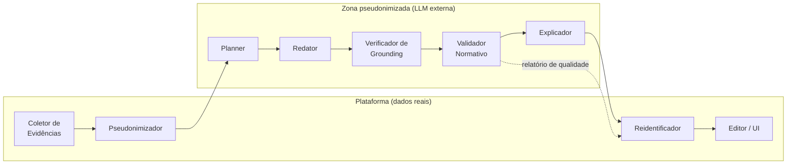

# 08 — Arquitetura de IA · RAV AI

**Versão:** 1.0 · 06/07/2026 · Aguardando validação
**Depende de:** 05-RNs (bloco RN-IA, RN-CNT, RN-SEG) · 02-PRD (RF-030..042, RNF-009/011/012) · 07-UX (contratos de UI: spans, explicações, diffs)
**Princípio arquitetural:** a IA é um pipeline auditável de etapas especializadas, não um prompt monolítico. Cada etapa tem contrato, versão e métrica.

---

## 1. Visão geral



Duas zonas com fronteira dura: **nenhum dado identificado cruza para a zona LLM** (RN-SEG-001). Todo o tráfego da zona LLM é logado com versão de prompt e modelo (RNF-012).

## 2. Fluxo dos agentes (pipeline de geração — RF-030)

| # | Etapa | Modelo | Entrada → Saída | RNs |
|---|-------|--------|-----------------|-----|
| 1 | **Coletor de Evidências** | determinístico | estudante+bimestre → pacote: observações exportáveis selecionadas, flags do Campo A, faltas/%, objetivos de aprendizagem do ano, "próximos passos" do RAV anterior, insumo ad-hoc | RN-IA-002 |
| 2 | **Pseudonimizador** | determinístico + NER | pacote → pacote com tokens (`{{EST_1}}`, `{{PROF_1}}`, `{{ESCOLA}}`); dicionário de reidentificação fica na plataforma | RN-SEG-001 |
| 3 | **Planner** | LLM leve (Haiku) | pacote → plano estruturado: quais evidências sustentam cada seção (diagnóstico/percurso/resultados/próximos passos), lacunas detectadas (elementos RN-CNT-001 sem evidência) | RN-CNT-001/002 |
| 4 | **Redator** | LLM principal (Claude Sonnet) | plano → texto em **JSON de claims**: lista de trechos, cada um com `evidence_ids[]`, `section`, `type: factual|conectivo` | RN-IA-002, RN-CNT-005/007 |
| 5 | **Verificador de Grounding** | LLM leve, prompt independente (juiz) | claims + evidências → veredicto por claim: `sustentado / não sustentado / extrapolação`; claim factual não sustentado é **removido ou rebaixado a pergunta ao professor** | RN-IA-002 |
| 6 | **Validador Normativo** | híbrido (ver §5) | texto → relatório: impedimentos, avisos, checklist RN-CNT/RN-RES | RN-IA-005 |
| 7 | **Explicador** | gerado junto ao Redator (campo `rationale` por trecho) + templates por regra no Validador | → justificativas exibíveis ("Por quê?" da UI) | RN-IA-003 |
| 8 | **Reidentificador** | determinístico | tokens → nomes reais, client-side na renderização | RN-SEG-001 |

Latência-alvo: streaming do Redator começa <2s (RNF-004); etapas 5–6 rodam sobre o texto completo e atualizam a zona Qualidade da UI de forma assíncrona.

**Fluxos secundários** reutilizam subconjuntos do pipeline: melhoria de escrita/correção (RF-035) = etapas 2→4→5→6 sobre trecho selecionado, saída como diff; modo entrevista (RF-036) = Planner invertido (gera perguntas das lacunas RN-CNT-001, respostas viram evidências do tipo "relato do professor"); classificação de tipo de observação (UX §4.1) = Haiku, single-shot.

## 3. Estratégia de modelos

| Papel | Primário | Fallback | Critério |
|-------|----------|----------|----------|
| Redator | Claude Sonnet | GPT (OpenAI) | Qualidade de escrita pt-BR pedagógica; teste cego no piloto |
| Planner / Juiz de grounding / classificações | Claude Haiku | GPT-mini | Custo (RNF-011): tarefas estruturadas de baixa complexidade |
| Embeddings (similaridade RF-042, RAG M3) | text-embedding (OpenAI) ou similar | — | pgvector; benchmark de recall em pt-BR |

Abstração provider-agnostic (interface única de chat/completions) — troca de provedor sem tocar na lógica; Gemini plugável no futuro [briefing]. **Regra do juiz independente:** o Verificador de Grounding nunca usa o mesmo prompt/contexto do Redator (evita autovalidação complacente).

## 4. Prompt Engineering

### 4.1 Anatomia do prompt do Redator

```
[SYSTEM — versionado: redator@v1.x]
Papel: professor(a) experiente dos Anos Iniciais da SEEDF, escrevendo o
Campo B do RAv conforme a norma 2024.
Regras inegociáveis (compiladas das RN-CNT):
- Escreva SOMENTE a partir das evidências fornecidas; sem evidência, não afirme. (RN-IA-002)
- Sequência: aprendizagens/dificuldades → intervenções → resultados → próximos passos. (RN-CNT-002)
- Vedado: rótulos, juízo de valor, características pessoais, termos sobre família/condição social,
  classificação técnica descontextualizada, texto-padrão. (RN-CNT-003..006)
- Aponte avanços, não apenas dificuldades. (RN-CNT-007)
- Não transcreva conteúdos da turma. (RN-CNT-008)
- Registre exigências condicionais ativas: {{flags → instruções RN-CNT-009}}
Estilo: descritivo, respeitoso, específico; 3ª pessoa; pt-BR; ~{{tamanho_alvo}} palavras.
Saída: JSON {claims: [{text, section, type, evidence_ids, rationale}]}.

[FEW-SHOT] 2–3 exemplos completos (evidências → claims) — ⚠ dependem dos
exemplos reais de RAV (pendência PO); no interim, exemplos sintéticos revisados por especialista.

[USER] Pacote de evidências pseudonimizado (JSON) + plano do Planner.
```

### 4.2 Práticas

- **Prompts como artefatos versionados** no repositório (`redator@v1.3`), com changelog e eval obrigatório antes de promover (ver §8); versão registrada em cada geração (RN-IA-004, RNF-012).
- **Regras normativas injetadas por configuração** (RN-DOC-006): o texto das regras no prompt vem do registro versionado por ano letivo, não hard-coded.
- **Temperatura** baixa-média no Redator (variação estilística sem criatividade factual — RN-CNT-005 exige textos distintos entre si); ~0 no Planner/Juiz/Validador.
- **Saída estruturada** (JSON schema/tool use) em todas as etapas — nunca parse de texto livre.
- **Orçamento de contexto:** evidências resumidas pelo Planner se excederem limite; nunca truncamento silencioso (professor é avisado de quais observações não couberam).

## 5. Validador Normativo — arquitetura híbrida (RF-040)

Três camadas, da mais barata/determinística à mais cara:

| Camada | Técnica | Cobre |
|--------|---------|-------|
| 1. Determinística | Regras de dados: Campo E×bimestre (RN-RES-001), enum (RN-RES-002), matriz ano×resultado (RN-RES-003), % faltas (RN-RES-004), unicidade (RN-FLX-001), léxico inicial de termos vedados (lista curada, alta precisão) | Tudo que é estrutural — sem LLM, sem custo, sem falso-positivo estocástico |
| 2. Classificador LLM | Haiku com rubrica fechada por categoria de vedação (RN-CNT-003/004/006) + detecção de elementos obrigatórios (RN-CNT-001) e equilíbrio (RN-CNT-007); saída: violações com trecho, categoria, severidade, sugestão de reescrita | Semântica: "não se interessa por nada" é juízo de valor mesmo sem palavra proibida |
| 3. Similaridade | Embeddings + pgvector: RAV atual × demais da turma (RN-CNT-005); limiar de aviso | Texto-padrão/cópia entre estudantes |

Política de severidade (RN-IA-005): camada 1 e categorias de vedação = **impedimento** (override justificado — RF-041); completude/equilíbrio/sequência/similaridade = **aviso**. Toda decisão exibe regra em linguagem humana + trecho + ação sugerida (contrato com UX §4.3).

## 6. Checklist mecanizado (mapa regra → verificação)

| Item da UI ("Qualidade") | Regra | Camada |
|---|---|---|
| Diagnóstico presente | RN-CNT-001a | 2 |
| Percurso/objetivos alcançados | RN-CNT-001b | 2 |
| Dificuldades + intervenções | RN-CNT-001d | 2 |
| Resultados das intervenções | RN-CNT-002 | 2 |
| Ação para o próximo bimestre | RN-CNT-001f | 2 |
| Sem rótulos/juízo de valor | RN-CNT-003 | 1+2 |
| Sem termos sobre família/condição social | RN-CNT-004 | 1+2 |
| Individualizado (não padrão) | RN-CNT-005 | 3 |
| Sem classificação técnica solta | RN-CNT-006 | 2 |
| Cita avanços, não só dificuldades | RN-CNT-007 | 2 |
| Sem conteúdos da turma | RN-CNT-008 | 2 |
| Condicionais (SuperaÇão, Sala de Recursos, busca ativa, avanço de estudos, RDIC/BIA) | RN-CNT-009 | 2, dirigida por flags |
| Resultado final coerente | RN-RES-001..004 | 1 |

## 7. Memória e RAG

### 7.1 Memória por estudante (MVP)

Contexto longitudinal estruturado, não vetorial: "próximos passos" do RAV anterior entram como evidência do novo diagnóstico (PRD §6.6); flags e histórico de resultados compõem o pacote. Nada de perfil comportamental persistente do estudante além do que está nas observações (RN-SEG-002 — minimização).

### 7.2 Memória de estilo do professor (M2+)

Preferências explícitas (tamanho de texto, formalidade) — configuração, não inferência. Aprendizado implícito de estilo a partir das edições: hipótese futura, condicionada a consentimento claro e avaliação de risco LGPD.

### 7.3 RAG (M3 — RF-038)

- **MVP (sem RAG):** objetivos de aprendizagem do Currículo em Movimento **curados e estruturados** por ano/componente em tabelas versionadas — determinístico, auditável, suficiente para grounding do diagnóstico.
- **M3:** corpus completo (Currículo em Movimento EF, Diretrizes 9dez24, Diretrizes 2º Ciclo, Caderno SuperaÇão, PPP da escola) em pgvector; chunking por seção normativa com metadados (documento, página, vigência); recuperação híbrida (BM25 + vetor); **toda citação com fonte e página** — mesma filosofia de rastreabilidade do grounding de evidências.
- Regra de precedência do corpus: norma vigente > material de formação; conflitos apontados, nunca resolvidos silenciosamente (protocolo do projeto).

## 8. Avaliação (evals) — porta de qualidade de cada release de prompt/modelo

| Eval | Método | Meta (gate) |
|------|--------|-------------|
| **Alucinação** | Corpus com evidências controladas; juiz + revisão humana amostral: nenhuma afirmação factual sem evidência | 0 críticas / geração (critério de aceite PRD §10.3) |
| **Anti-viés (recall)** | Corpus com violações plantadas por categoria | ≥90% recall, precisão ≥80% (H-2, PRD §10.4) |
| **Completude** | RAVs de referência com elementos removidos | detecção ≥90% |
| **Individualização** | Gerar turma sintética inteira; distribuição de similaridade | abaixo do limiar RF-042 |
| **Qualidade pedagógica** | Rubrica de 6 critérios [PPTX §5] aplicada por especialista (CRAI/coordenador convidado) em amostra cega humano×IA | IA ≥ média humana da amostra |
| **Regressão** | Suite completa a cada mudança de prompt/modelo/regra | sem regressão >2pp |

⚠ **Dependência crítica:** os corpora de alucinação e anti-viés precisam dos **exemplos reais de RAV** (pendência PO — PRD §12). Cronograma de evals bloqueia sem eles.

## 9. Pseudonimização (detalhe da RN-SEG-001)

1. **Dicionário determinístico:** nomes cadastrados (estudantes da turma, professores, escola) → tokens estáveis por sessão de geração.
2. **NER de segurança:** passada de reconhecimento de entidades sobre o texto das observações captura nomes não cadastrados (colegas, familiares) → tokens genéricos.
3. **Teste de vazamento automatizado** (RNF-009): asserção em CI + monitor de produção sobre amostra de payloads; violação = incidente.
4. Reidentificação apenas na renderização, dicionário nunca sai da plataforma; logs da zona LLM armazenam somente conteúdo pseudonimizado.

## 10. Degradação, custo e observabilidade

- **IA indisponível:** editor permanece 100% funcional (RNF-006); fila de revalidação; mensagem UX §6.2.
- **Custo (RNF-011):** orçamento por RAV monitorado por etapa; freemium limita gerações/mês, não observações (o hábito nunca é cobrado — decisão de produto alinhada a OBJ-3); cache de validações por hash do texto.
- **Observabilidade:** trace por geração (etapas, latências, tokens, versões, custo); painel de métricas de IA ligado aos indicadores da Visão §5 (taxa de aceite, edição pós-geração, anti-métrica de aceite cego).

## 11. Riscos específicos e mitigação

| Risco | Mitigação |
|-------|-----------|
| Falso-positivo do anti-viés irritar o professor | Camada 1 de alta precisão; tom de aliado (UX §6.2); override fácil e auditado; métrica de override por regra recalibra o classificador |
| Redator "melhorar" evidência fraca em afirmação forte (extrapolação) | Categoria explícita `extrapolação` no juiz; rebaixamento a pergunta ("Você observou se…?") |
| Homogeneização estilística da turma | Temperatura calibrada + eval de individualização + variação de estruturas no prompt |
| Deriva de qualidade em troca de modelo/provedor | Suite de regressão §8 como gate obrigatório |
| Custo explodir no pico de fim de bimestre | Haiku nas etapas 3/5/6; cache; limites de regeneração no free |

**Documentos impactados:** 03-Arquitetura (fronteira de zonas, fila, streaming), 04-Dados (claims, evidências, versões de prompt, dicionário de pseudônimos), 06-APIs (contratos do pipeline), 10-Testes (evals §8), 11-Segurança (RN-SEG-001, logs).
